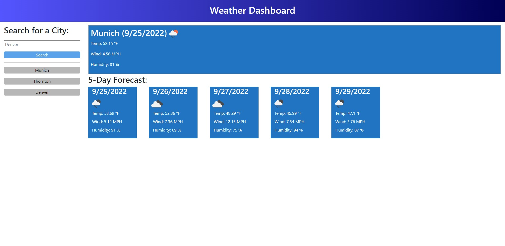

# Weather Forcast

## Description

This weather forcast application allows you to view weather data for any city that you input.

I built this project to understand third party API's and build something based on the data that was provided instead of the data that I built.
This solves the problem that occurs when a user needs to plan for what the weather is going to look like in the upcoming week.
I learned alot about accessing server-side APIs and working with the data that's provided to me.

## Installation

N/A

## Usage

To use this application, type a city name into the text box and press the search button. This will bring the 5 day forcast for that city and save it into history. To view a city from history, click on the button with its name and you'll be presented with the same information but for that city.

[Deployed Application](https://tuinderj.github.io/weather-forcast/)

